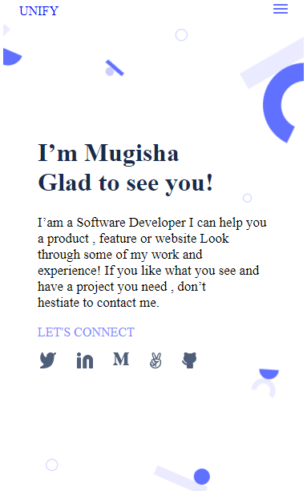

# Microverse

## personal portfolio

## microverse project setup

## Additional description about the project and its features.
- Understanding Git, and GitHub.
- Understanding GitHub Flow.
- Understaanding linters and the structure and use of HTML & CSS

## Built With
- html and css

### Technologies used
- git
- Github

## Live Demo Link
- click here to view this project (https://mugishasam123.github.io/portfolio-website/)

### Getting Started
in order to run project locally you first have to clone it to your computer after run it in web browser by opening  index.html 

### Prerequisites
## Setup
no setup
## Install
you need to clone the project files to your laptop and after you run them locally in your laptop

## Run tests
no tests required.

### Authors

## 👤 Author
. GitHub:https://github.com/mugishasam123/

.Twitter: https://twitter.com/mugishasamuel42/

.LinkedIn: https://www.linkedin.com/in/mugisha-samuel-55a905208/

## 🤝 Contributing
Contributions, issues, and feature requests are welcome!

Feel free to check the issues page.

## Show your support
Give a ⭐️ if you like this project!

## Acknowledgments
    Hat tip to anyone whose code was used 
    Microverse program 
    My standup team 
    My family's support 

## 📝 License

This project is open source project.