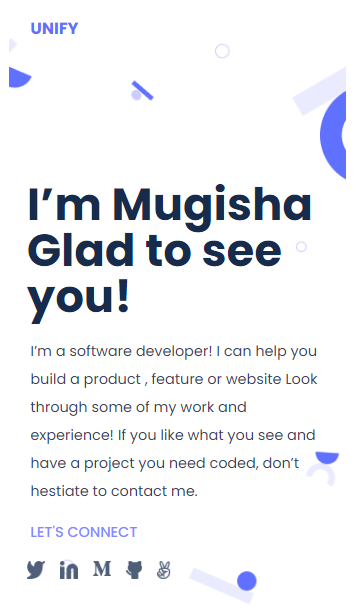

# portfolio website

> One paragraph statement about the project.

Additional description about the project and its features.

## Built With

- Major languages
- Frameworks
- Technologies used

## Live Demo

[Live Demo Link](https://mugishasam123.github.io/portfolio-website/)

## Getting Started

**This is an example of how you may give instructions on setting up your project locally.**
**Modify this file to match your project, remove sections that don't apply. For example: delete the testing section if the currect project doesn't require testing.**

To get a local copy up and running follow these simple example steps.

### Prerequisites

### Setup
**N/A
## Authors

👤 **Author**

- GitHub: [@githubhandle](https://github.com/mugishasam123)
- Twitter: [@twitterhandle](https://twitter.com/mugishasamuel42/)
- LinkedIn: [LinkedIn](https://www.linkedin.com/in/mugisha-samuel-55a905208/)

## 🤝 Contributing

Contributions, issues, and feature requests are welcome!

Feel free to check the [issues page](../../issues/).

## Show your support

Give a ⭐️ if you like this project!

## Acknowledgments

- Hat tip to anyone whose code was used
- Inspiration
- etc

## 📝 License

This project is [MIT] licensed.
